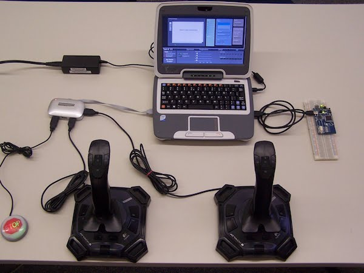
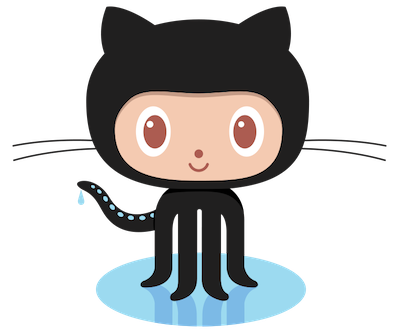

# FRC Programming and Controls

### Adam Brightwell
### January 7th, 2017

# Who?

* Software/Database Engineer
* Contributor to [PostgreSQL](http://www.postgresql.org/) Open Source Database
* Team 4533 - Lead Programming and Controls Mentor

# Controls

# Overview

## Control System
<ul>
<li class="fragment">Driver Control System - The interface between the operator and the robot</li>

<li class="fragment">Robot Control System - The electronic hardware/software inside the robot</li>

<li class="fragment">Wireless Communication System - A local area network router establishing wireless/tethered communication between a driver and the robot</li>
</ul>

## Driver Control System
## (Driver Station)

<ul>
<li>A netbook/laptop PC</li>
<li>Up to four (4) USB Joysticks or [Game Pads](http://gaming.logitech.com/en-us/product/f310-gamepad)</li>
<li>A USB hub</li>
<li>Other custom controls (2012 introduced the MS Kinect).</li>
</ul>

## Example Driver Station

## Robot Control System

<ul>
<li>A National Instruments roboRIO (no more cRIO)</li>
<li>A power distribution system (new)</li>
<li>Motor controllers, relays, solenoids, sensors, etc.</li>
</ul>

# Programming Languages

## LabView
<ul class="fragment">
    <li class="fragment">Graphical Programming Environment</li>
    <li class="fragment">Developed by National Instruments</li>
    <li class="fragment">Not a "language"</li>
    <li class="fragment">Difficult to debug</li>
    <li class="fragment">It's HUGE!</li>
</ul>

## LabView

## Java
<ul>
    <li class="fragment">Object Oriented Programming (OOP) Language</li>
    <li class="fragment">Owned and maintained by Oracle</li>
    <li class="fragment">Java Micro Edition (Java ME)</li>
    <li class="fragment">Beginner Friendly</li>
    <li class="fragment">([Installing Java Development Tools](http://wpilib.screenstepslive.com/s/3120/m/7885/l/79405-installing-the-java-development-tools))</li>
</ul>

## C++
<ul>
<li class="fragment">Object Oriented Programming Language</li>
<li class="fragment">No longer WindRiver C++ (woot!)</li>
<li class="fragment">Not Beginner Friendly (I can't remember what I did with my memory)</li>
<li class="fragment">Workshop will be available</li>
</ul>

# Programming The Robot

# The Basics

## Control Objects
* Joystick
* SpeedController
* DigitalInput/DigitalOutput

## Robot Types

## Simple Robot
* "autonomous"
* "operatorControl"

## Iterative Robot
* Simple Robot 2.0
* Initialization and clean up methods.

## Command Robot

* Subsystems
* Commands
* Command Groups

## Robot Modes
* Operator Control (TeleOp)
* Autonmous

# [Example](https://github.com/abrightwell/frc-kickoff-example/blob/master/src/edu/wpi/first/wpilibj/templates/RobotTemplate.java)

# Version Control

Workshop?

# Virtual Workshops

* Every Thursday 5-6pm for all 6 weeks of build season
* Google Hangout (On Air)
* Programmer Driven
* Please sign up to receive workshop invites

* Week 1: Getting Started - Installing tools and first steps
* Week 2: Networking - Setting up the wireless network
* Week 3: Robot Basics - Motor Controllers, sensors, oh my!
* Week 4: SmartDashboard
* Week 5: Robot Vision?
* Week 6: Open Questions and Answers

# Follow Us
* [github.com/wando-advanced-robotics](https://github.com/wando-advanced-robotics)
* [github.com/frc-team-342](https://github.com/frc-team-342)

# Contact

* Email: [adam.brightwell@gmail.com](mailto:adam.brightwell@gmail.com)
* GTalk: adam.brightwell
* Skype: adam.brightwell
* IRC: abrightwell@irc.freenode.net
